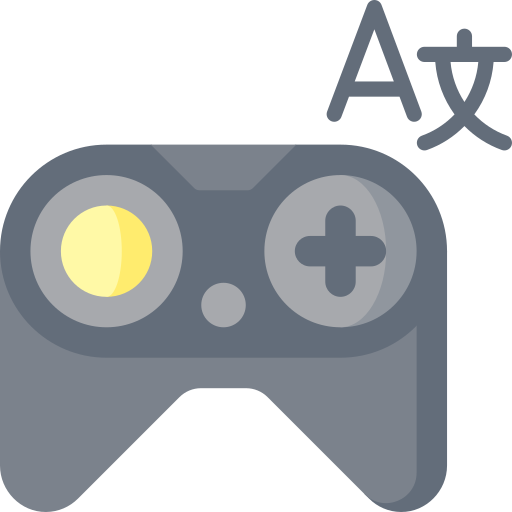
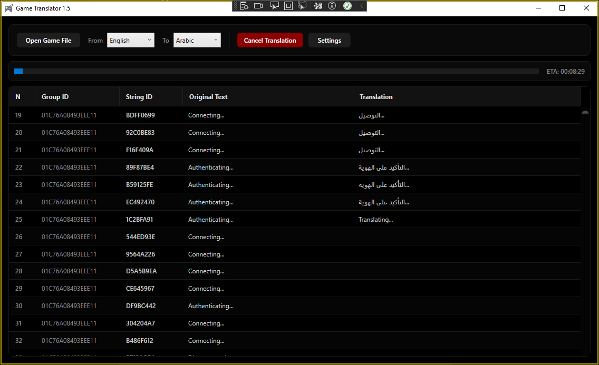
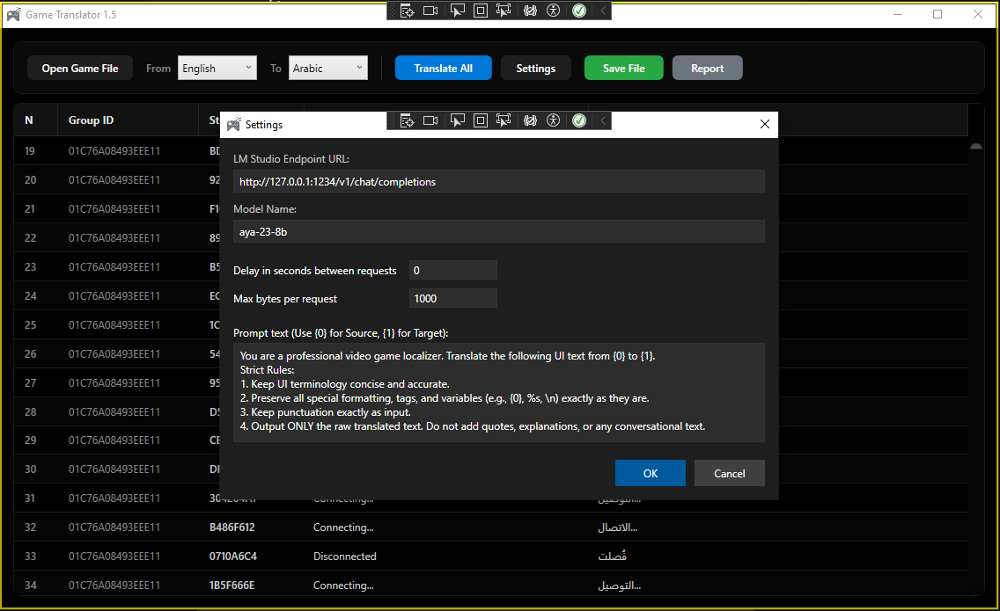
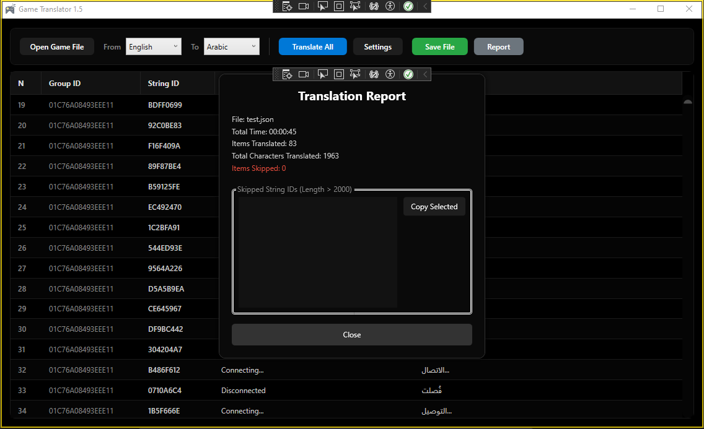

# Game Translator



A professional, fully offline Windows desktop application built to streamline video game localization. Developed with **C#** and **WPF (.NET 8)** using the **MVVM** architecture, this tool connects seamlessly to local Large Language Models (LLMs) via OpenAI-compatible endpoints (such as **LM Studio**) to translate large JSON game files with precision, speed, and complete privacy.

---

## 🚀 Key Features

- **Offline-First & Zero Telemetry**  
  Designed for complete privacy. Every translation request is processed locally, making the application suitable for air-gapped environments while keeping proprietary game files secure.

- **OpenAI-Compatible API Support**  
  Works with any OpenAI-compatible endpoint, including **LM Studio**, allowing complete flexibility when choosing local language models.

- **Modern OLED-Friendly Interface**  
  A sleek pitch-black theme optimized for OLED displays, reducing eye strain during long translation sessions.

- **Live Side-by-Side Translation**  
  Monitor translation progress in real time through an optimized, virtualized `DataGrid` that displays both original and translated text.

- **Smart Auto-Skip System**  
  Automatically skips extremely long strings (such as EULA or Privacy Policy entries exceeding 2000 characters) to avoid VRAM exhaustion and reduce LLM hallucinations.

- **Translation Report Generation**  
  Generates a detailed report after every translation session, including:
  - Total translation time
  - Number of translated entries
  - Total translated characters
  - Skipped String IDs
  - Quick-copy list for manual review

- **Hardware Load Control**  
  Configure delays between API requests to reduce GPU and CPU load when using local AI models.

- **Safe JSON Export**  
  Preserves the original JSON structure while ensuring proper UTF-8 Arabic encoding without unwanted Unicode escaping. Choose to overwrite the original file or save as a new copy.

- **Automatic Settings Persistence**  
  Saves API configuration, selected model, prompts, and user preferences automatically between sessions.

- **Custom Prompt Engineering**  
  Create and modify translation prompts to improve translation quality for different games and genres.

- **Progress Tracking**  
  Real-time progress indicators, translated entry counters, elapsed time tracking, and responsive cancellation support.

- **Responsive MVVM Architecture**  
  Built using the MVVM pattern with clean separation between UI, business logic, and data models for maintainability and scalability.

---

## 📸 Screenshots

### Main Interface



*The primary workspace featuring language selection, progress tracking, and live side-by-side translation.*

---

### Settings Configuration



*Configure API endpoints, model selection, translation prompts, and request throttling.*

---

### Translation Report



*Comprehensive translation summary including skipped IDs for quick manual review.*

---

## 🏗️ Project Structure

The project follows the **MVVM (Model–View–ViewModel)** architecture for clean, maintainable, and scalable code.

```text
GameTranslator
├── Dependencies
├── assets
│   ├── icon.ico
│   ├── icon.png
│   ├── main-page.png
│   ├── report-page.png
│   └── settings-page.png
├── Models
│   ├── LMStudioModels.cs
│   ├── TranslationItem.cs
│   └── TranslationSettings.cs
├── Services
│   ├── SettingsService.cs
│   └── TranslationService.cs
├── ViewModels
│   └── MainViewModel.cs
├── Views
│   ├── CustomAlertWindow.xaml
│   │   └── CustomAlertWindow.xaml.cs
│   ├── MainWindow.xaml
│   │   └── MainWindow.xaml.cs
│   ├── ReportWindow.xaml
│   │   └── ReportWindow.xaml.cs
│   ├── SaveOptionsWindow.xaml
│   │   └── SaveOptionsWindow.xaml.cs
│   ├── SettingsWindow.xaml
│   │   └── SettingsWindow.xaml.cs
├── App.xaml
├── AssemblyInfo.cs
└── README.md
```

---

## 🛠️ Technology Stack

| Category | Technology |
|----------|------------|
| Framework | .NET 8 |
| Language | C# |
| Desktop UI | WPF (Windows Presentation Foundation) |
| Architecture | MVVM |
| MVVM Toolkit | CommunityToolkit.Mvvm |
| JSON Processing | System.Text.Json |
| Encoding | UnsafeRelaxedJsonEscaping |
| HTTP Client | System.Net.Http.HttpClient |
| AI Integration | OpenAI-Compatible REST API |
| Local AI | LM Studio |

---

## ⚙️ Requirements

- Windows 10 / Windows 11
- .NET 8 Runtime
- LM Studio (or any OpenAI-compatible server)
- Local LLM capable of translation
- Sufficient GPU VRAM (recommended for larger models)

---

## 📄 Translation Workflow

1. Launch the application.
2. Connect to your local OpenAI-compatible endpoint.
3. Select an installed AI model.
4. Load the game's JSON localization file.
5. Configure translation settings and prompt.
6. Start translation.
7. Monitor progress in real time.
8. Review the generated report.
9. Save the translated localization file.

---

## 🎯 Design Goals

- Fully offline operation
- Maximum translation accuracy
- Privacy-first workflow
- Stable performance with large localization files
- Clean and maintainable architecture
- Simple user experience

---

## 📌 Future Improvements

- Batch translation for multiple JSON files
- Resume interrupted translations
- Multiple translation provider support
- Translation memory (TM)
- Terminology glossary
- Search and replace
- Built-in JSON validation
- Export translation statistics
- Theme customization
- Multi-language user interface

---

## 👨‍💻 Developer & Contact

**Ali Nasser Al-ojeely (Mr.Ghost)**  
*Frontend & Desktop Application Developer*

[](https://github.com/AliAl-ojeely)

[](mailto:alialojeely@gmail.com)

If you have suggestions, encounter bugs, or would like to contribute to the project, feel free to open an issue or contact me directly.

---

## ⭐ Support

If you find this project useful, consider giving it a **star** on GitHub. Your support helps improve the project and motivates future development.
